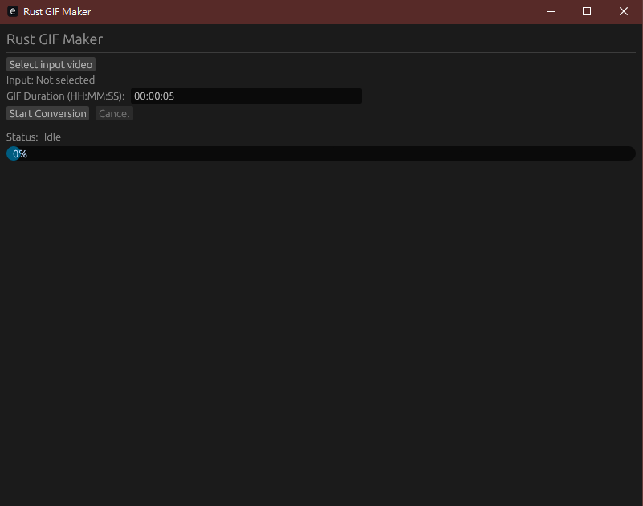

# Rust GIF Maker

一個使用 Rust 和 egui 開發的視頻轉 GIF 工具，提供圖形化用戶界面。



## 功能特性

- 🎬 支持多種視頻格式（MP4、MOV、MKV、WebM）
- 🎞️ 自動提取視頻幀並轉換為 GIF
- ⏱️ 自定義 GIF 時長
- 📊 實時進度顯示
- ⏸️ 支持取消操作

 ## [下載 Release](https://github.com/yuuhouse/GIF-Maker-STONEv2/releases)


## 系統要求

- Rust 1.70 或更高版本
- FFmpeg（用於視頻幀提取）
- Windows/Linux/macOS

## 安裝

### 1. 安裝 FFmpeg

**Windows:**
```bash
# 使用 Chocolatey
choco install ffmpeg

# 或使用提供的 ffmpeg 資料夾
```

### 2. 編譯項目

```bash
cargo build --release
```

## 使用方法

### 啟動應用

```bash
cargo run --release
```

或是進到
```bash
GIF-Maker-STONEv2\target\release\gif_maker_egui.exe
``` 
點擊EXE使用

### 操作步驟

1. 點擊 **"Select input video"** 按鈕選擇視頻文件
2. 設定 GIF 時長（格式：HH:MM:SS），例如 `00:00:05` 表示 5 秒
3. 點擊 **"Start Conversion"** 開始轉換
4. 等待進度完成或點擊 **"Cancel"** 取消操作

輸出的 GIF 文件將與輸入視頻保存在同一資料夾中。

## 項目結構

```
GIF-Maker-STONEv2/
├── src/
│   └── main.rs          # 主程序代碼
├── Cargo.toml           # 項目配置
├── ffmpeg/              # FFmpeg 二進制文件及文檔
├── assets/              # 資源文件
└── target/              # 編譯輸出
```

## 技術棧

- **UI 框架**: egui
- **圖像處理**: image
- **GIF 編碼**: gif
- **視頻提取**: FFmpeg
- **多線程**: std::thread、Arc、Mutex

## 依賴項

主要依賴在 `Cargo.toml` 中定義：
- `eframe` - 窗口和事件循環
- `egui` - GUI 框架
- `image` - 圖像處理
- `gif` - GIF 編碼
- `rfd` - 文件選擇對話框
- `glob` - 文件匹配
- `tempfile` - 臨時文件管理

## 工作流程

1. **幀提取**: 使用 FFmpeg 提取視頻幀為 PNG 圖片
2. **收集幀**: 從臨時目錄收集所有提取的幀
3. **編碼**: 使用 gif 庫將幀編碼為 GIF 文件
4. **清理**: 自動刪除臨時文件

## 注意事項

- GIF 幀率固定為 15 fps
- 每幀延遲自動計算以確保流暢播放
- 支持取消正在進行的轉換
- 輸出 GIF 將無限循環播放

## 常見問題

**Q: 轉換時間很長？**
<br>A: 轉換速度取決於視頻分辨率和時長。高解析度視頻需要更多時間。

**Q: 輸出 GIF 文件大小很大？**
<br>A: GIF 格式不如現代視頻格式高效。可以嘗試縮短時長或使用視頻編輯軟件降低分辨率。

**Q: FFmpeg 未找到？**
<br>A: 確保 FFmpeg 已安裝並在系統 PATH 中，或使用提供的 ffmpeg 目錄。

**Q: 找不到轉換後的 GIF 檔案？**
<br>A: GIF 檔案會自動保存在與輸入視頻相同的資料夾中，檔案名稱與輸入視頻相同但副檔名為 `.gif`。例如輸入 `video.mp4`，輸出會是 `video.gif`。請檢查：
  1. 查看應用程序的狀態欄是否顯示 "Completed"
  2. 確認輸入視頻所在的資料夾
  3. 嘗試在檔案管理器中按 F5 刷新資料夾
  4. 確保您對該資料夾有寫入權限

---

**開發者**:ChatGPT<br>
**最後更新**: 2025 年 12 月<br>
**MD檔案**：由Copilot撰寫
